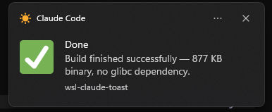

# wsl-claude-toast

Native Windows Toast notifications from WSL, designed for
[Claude Code](https://docs.claude.com/en/docs/claude-code) hooks (also usable
as a standalone CLI). Single self-contained Rust binary, no Python or
PowerShell dependency required at the project level.



## Features

- Modern Windows toasts via
  `Windows.UI.Notifications.ToastNotificationManager`, called through
  `powershell.exe` from WSL.
- Auto-detection of the `AppUserModelID` to use (priority on a personal
  `ClaudeCode.Notifier` AppID, then Claude → Windows PowerShell).
- Personal AppID registration **without administrator rights**, via a
  `.lnk` shortcut placed in the per-user Start Menu plus `IPropertyStore`
  (the technique used by BurntToast).
- Icons embedded into the binary (`include_bytes!`) and extracted at
  runtime to `%LOCALAPPDATA%\claude-notify\icons\`:
  `permission` (lock), `stop` (green check), `default` (speech bubble).
- `--hook` mode: reads the Claude Code JSON event from stdin and
  automatically derives title, message, icon and footer (git repo name
  when available, otherwise the full `cwd`).
- **Terminal tab renaming**: in `--hook` mode the binary also rewrites
  the hosting terminal tab title (Windows Terminal / PowerShell /
  any OSC-0 capable emulator) to `<emoji> <project>` — 🔐 for
  permission prompts, ✅ for `Stop`, 💬 otherwise. Makes it obvious
  which tab needs attention when several Claude Code sessions are
  running side by side. Set `WCT_NO_TAB_TITLE=1` to opt out.
- Idempotent install/uninstall of the hook in
  `~/.claude/settings.json` (`--install-hook` / `--uninstall-hook`).
- **Localized output** (toasts + CLI messages) in 5 languages: English,
  French, Spanish, German, Italian. Auto-detected from the Windows display
  language ((Get-Culture).TwoLetterISOLanguageName). Falls back to English
  if the locale is unsupported.

## Requirements

- WSL 2 on Windows 10/11.
- Rust ≥ 1.75 (`rustup`) to build.
- `powershell.exe` reachable from the WSL `PATH` (default).
- No Windows administrator rights required.

## Installation

### One-liner (recommended)

Detects your CPU architecture, downloads the matching pre-built binary from
the latest GitHub release, places it in `~/.claude/bin/`, and runs
`--install-hook`. No Rust toolchain required.

With `wget` :

```bash
wget -qO- https://raw.githubusercontent.com/sebastienheyd/wsl-claude-toast/main/install.sh | bash
```

Or with `curl` :

```bash
curl -fsSL https://raw.githubusercontent.com/sebastienheyd/wsl-claude-toast/main/install.sh | bash
```

Optional environment variables:

| Variable          | Default              | Purpose                                       |
|-------------------|----------------------|-----------------------------------------------|
| `WCT_VERSION`     | `latest`             | Pin a specific tag, e.g. `WCT_VERSION=v0.1.0` |
| `WCT_INSTALL_DIR` | `$HOME/.claude/bin`  | Target directory                              |
| `WCT_NO_HOOK`     | unset                | `1` to skip the `--install-hook` step         |

Example:

```bash
curl -fsSL https://raw.githubusercontent.com/sebastienheyd/wsl-claude-toast/main/install.sh | WCT_VERSION=v0.1.0 bash
```

### Manual download

If you'd rather not pipe a script, grab the binary directly from the
[releases page](https://github.com/sebastienheyd/wsl-claude-toast/releases):

```bash
mkdir -p ~/.claude/bin
# x86_64 (most WSL 2 setups):
wget -O ~/.claude/bin/wsl-claude-toast \
  https://github.com/sebastienheyd/wsl-claude-toast/releases/latest/download/wsl-claude-toast-linux-x86_64
# arm64:
# wget -O ~/.claude/bin/wsl-claude-toast \
#   https://github.com/sebastienheyd/wsl-claude-toast/releases/latest/download/wsl-claude-toast-linux-aarch64
chmod +x ~/.claude/bin/wsl-claude-toast
~/.claude/bin/wsl-claude-toast --install-hook
```

### From source

```bash
git clone https://github.com/sebastienheyd/wsl-claude-toast.git
cd wsl-claude-toast
cargo build --release
mkdir -p ~/.claude/bin
cp target/release/wsl-claude-toast ~/.claude/bin/wsl-claude-toast
~/.claude/bin/wsl-claude-toast --install-hook
```

`--install-hook` runs two idempotent steps:

1. **Personal AppID registration**: creates
   `%APPDATA%\Microsoft\Windows\Start Menu\Programs\Claude Code.lnk` with
   `System.AppUserModel.ID = ClaudeCode.Notifier` and an icon. The icon is
   resolved in this order:
   1. `%LOCALAPPDATA%\ClaudeCodeNotify\icon.ico` (custom override, if present);
   2. `%LOCALAPPDATA%\ClaudeCodeNotify\icon.png` (custom override, wrapped
      into an `.ico` and cached on first install);
   3. otherwise the embedded neutral sun icon (Twemoji ☀️, CC-BY 4.0).

   A ~5 s pause lets Windows index the new shortcut.

   Re-run `--install-hook` after dropping or changing your custom icon to
   refresh the shortcut's `IconLocation` (Windows caches icons in the
   Action Center, so a sign-out / `ie4uinit.exe -show` may also be needed
   to evict the cache).
2. **Claude Code hook**: adds two entries to
   `~/.claude/settings.json` (`Stop` and `Notification` with matcher
   `permission_prompt`) pointing to `~/.claude/bin/wsl-claude-toast --hook`.
   Other hooks and keys in the file are preserved.

### Uninstall

```bash
~/.claude/bin/wsl-claude-toast --uninstall-hook
```

Removes the entries from `settings.json` and deletes the `.lnk` (only
when its AppID matches `ClaudeCode.Notifier`).

## Manual usage (without the hook)

```bash
wsl-claude-toast "Title" "Message body"
wsl-claude-toast "Title" "Message" --icon permission
wsl-claude-toast "Title" "Message" --icon ~/path/to/icon.png
wsl-claude-toast "Title" "Message" --icon "https://example.com/logo.png"
wsl-claude-toast "Title" "Message" --footer "my-project"
wsl-claude-toast "Title" "Message" --app-id "MyAppID"
```

| Argument                | Description                                                                                |
|-------------------------|--------------------------------------------------------------------------------------------|
| `title` (positional)    | Toast title.                                                                               |
| `message` (positional)  | Body. Supports `\n`, `\t`, `\r`, `\\` escapes.                                             |
| `--icon <SRC>`          | Builtin name (`permission`, `stop`, `default`), WSL/Windows path, or `http(s)://` URL.     |
| `--footer <TXT>`        | Attribution text displayed at the bottom of the toast.                                     |
| `--app-id <ID>`         | Force a specific AppUserModelID. Without it, auto-detection kicks in.                      |
| `--hook`                | Read a Claude Code JSON event from stdin and derive title / icon / footer.                 |
| `--install-hook`        | Register the hook in `~/.claude/settings.json` and the personal AppID.                     |
| `--uninstall-hook`      | Remove the hook and delete the AppID shortcut.                                             |

## Claude Code hook mode

When Claude Code fires a hook, it sends a JSON document on stdin. The
binary parses it and selects:

| `hook_event_name` / `notification_type` | Title                | Icon         |
|-----------------------------------------|----------------------|--------------|
| `Notification` + `permission_prompt`    | Authorization needed | `permission` |
| `Stop`                                  | Done                 | `stop`       |
| anything else                           | Claude Code          | `default`    |

The footer is computed from `cwd`:

1. If `cwd` lives inside a git repository → `basename` of the git root
   (`git rev-parse --show-toplevel`).
2. Otherwise → the full `cwd` path.

The same project label is reused to rewrite the hosting tab title via
an OSC 0 escape sequence written to `/dev/tty`, prefixed with an
emoji that mirrors the toast icon: 🔐 (permission), ✅ (stop) or
💬 (default). Set `WCT_NO_TAB_TITLE=1` in `~/.claude/settings.json`
(`env` block) to disable this behaviour while keeping the toast.

## Architecture

```
wsl-claude-toast/
├── assets/
│   ├── sun.png              # Neutral fallback (Twemoji ☀️)
│   ├── sun.ico              # Multi-resolution, embedded in the binary
│   ├── permission.png        # Toast icon (Twemoji 🔐)
│   ├── stop.png              # Toast icon (Twemoji ✅)
│   ├── default.png           # Toast icon (Twemoji 💬)
│   └── i18n/                 # Embedded translations (en/fr/es/de/it)
├── src/
│   └── main.rs               # All code, single file
├── Cargo.toml
└── README.md
```

### Adding or fixing a translation

Each language is a single flat JSON file under `assets/i18n/`. Edit
`fr.json`, `es.json`, etc., or copy `en.json` to a new locale code
(e.g. `pt.json`) and add the corresponding match arm in `Lang::detect`
and `Lang::raw` (`src/main.rs`). Missing keys fall back to English
automatically.

The binary embeds every asset through `include_bytes!`. At runtime icons
are written once to `%LOCALAPPDATA%\claude-notify\icons\` (Toast cannot
load images from memory nor from a UNC path such as `\\wsl.localhost\…`).

### Why a personal AppID?

Without registration, Toast must borrow the identity of an installed
application (Claude, PowerShell, …). The displayed source is therefore
incorrect. The personal AppID `ClaudeCode.Notifier` provides:

- "Claude Code" displayed as the toast source.
- A neutral sun icon (Twemoji ☀️) in the Action Center entry, replaceable by
  a user-provided icon at `%LOCALAPPDATA%\ClaudeCodeNotify\icon.png` (see
  the *License* section).
- No system-wide change (`HKEY_CLASSES_ROOT` untouched).
- No administrator privileges.

Microsoft reference:
[Enable desktop toast notifications through an AppUserModelID](https://learn.microsoft.com/en-us/previous-versions/windows/desktop/legacy/hh802762(v=vs.85)).

## Known limitations

- The `.lnk` is visible in the per-user Start Menu (under `Claude Code`).
  Manually removing it breaks the auto-detection.
- ~5 s wait on the first `--install-hook` while Windows indexes the new
  shortcut — this is OS-intrinsic.
- Custom environment variables forwarded to PowerShell rely on the
  `WSLENV` mechanism; recent WSL 2 required.
- Toast `appLogoOverride` does not accept UNC paths: icons must live on
  the local Windows drive (the binary handles this automatically).

## Build & development

```bash
cargo build --release          # Size-optimized binary (~736 KB)
cargo build                    # Dev build
cargo clippy                   # Lint
```

Release profile in `Cargo.toml` is set to `opt-level=z`, `lto=true`,
`strip=true`, `panic=abort` to minimise binary size.

## Disclaimer

This is an **independent, community project**. It is not affiliated with,
endorsed by, or sponsored by Anthropic PBC. "Claude" and "Claude Code" are
trademarks of Anthropic PBC.

## License

The code in this repository is licensed under the MIT License (see [LICENSE](LICENSE)).

This repository **does not** include the Claude Code logo or any other
Anthropic trademark. If you wish to display the official Claude Code icon
in your notifications, you must obtain it yourself (e.g., from Anthropic's
press kit) and place it at `%LOCALAPPDATA%\ClaudeCodeNotify\icon.png`.
A neutral fallback icon (a sun ☀️ from
[Twemoji](https://github.com/twitter/twemoji), licensed under
[CC-BY 4.0](https://creativecommons.org/licenses/by/4.0/)) is used otherwise.

The toast inline icons (`assets/permission.png`, `assets/stop.png`,
`assets/default.png`) are also from Twemoji (CC-BY 4.0).

### Contributing

Contributions are welcome. Unless you explicitly state otherwise, any
contribution you intentionally submit for inclusion in the work shall be
licensed under the MIT License, without any additional terms or conditions.
